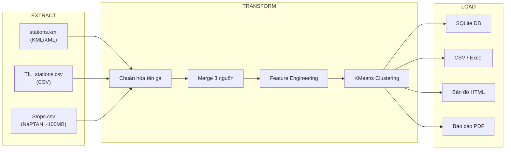

# 📋 TỔNG HỢP KỸ THUẬT DỰ ÁN TfL LONDON — NHÓM 14

> Tổng hợp toàn bộ các **kỹ thuật, quy tắc, phương pháp, công thức, thuật toán, logic, cấu trúc dữ liệu và code** đã xây dựng trong dự án phân tích hệ thống giao thông công cộng London (TfL).

---

## 1. KIẾN TRÚC TỔNG QUAN HỆ THỐNG

### 1.1 Mô hình ETL Pipeline



### 1.2 Cấu trúc tệp tin dự án

| Tệp | Vai trò | Ngôn ngữ / Thư viện |
|------|---------|---------------------|
| [final_project.py](file:///c:/Users/My%20PC/Downloads/DE/final_project.py) | Pipeline ETL chính (1805 dòng) | Python, Pandas, Sklearn, SQLite, Folium |
| [generate_pdf_report.py](file:///c:/Users/My%20PC/Downloads/DE/generate_pdf_report.py) | Sinh báo cáo PDF chuyên sâu | ReportLab, Matplotlib |
| [serve_outputs.py](file:///c:/Users/My%20PC/Downloads/DE/serve_outputs.py) | HTTP Server + Public Tunnel | ThreadingHTTPServer, ngrok/localtunnel |
| [verify_data.py](file:///c:/Users/My%20PC/Downloads/DE/verify_data.py) | Xác minh kết quả pipeline | Pandas |

---

## 2. CÁC THUẬT TOÁN & PHƯƠNG PHÁP

### 2.1 Thuật toán chuẩn hóa tên ga (Name Normalization)

> **Mục đích:** Ghép nối (merge) dữ liệu từ 3 nguồn khác nhau đặt tên ga không nhất quán.

**Logic xử lý** — [normalize_station_name()](file:///c:/Users/My%20PC/Downloads/DE/final_project.py#L161-L194):

```
Bước 1: Chuyển lowercase, thay "&" → " and ", loại "st." → "st"
Bước 2: Loại bỏ hậu tố lặp (while loop) từ danh sách LINE_SUFFIXES
         Bao gồm: "underground station", "overground station", "dlr station",
                   "elizabeth line station", "tram stop", "lu", "lo", "nr", ...
Bước 3: Loại ký tự đặc biệt bằng regex [^\w\s']
Bước 4: Ánh xạ alias thủ công (manual mapping):
         • "bank" | "monument"         → "bank and monument"
         • "crossharbour and london arena" → "crossharbour"
         • "heathrow terminals 123/2 and 3" → "heathrow terminals 1 2 3"
         • "hammersmith d and p"        → "hammersmith"
```

**Danh sách 22 hậu tố** được định nghĩa tại [LINE_SUFFIXES](file:///c:/Users/My%20PC/Downloads/DE/final_project.py#L64-L92):

```python
LINE_SUFFIXES = [
    " underground station", " overground station", " rail station",
    " dlr station", " elizabeth line station", " tram stop", " station",
    " lu", " lo", " nr", " dlr", " el", " tfl",
    " (dis)", " (bak)", " (h&c)", " (d & p)",
    " h&c", " dis", " bak", " d & p",
    " bakerloo", " circle", " central",
    " hammersmith & city", " hammersmith and city",
]
```

---

### 2.2 Thuật toán Nearest Neighbor Matching (Ghép vị trí địa lý)

> **Bài toán:** Một ga trong KML có thể ứng với nhiều bản ghi trong Stops.csv (NaPTAN). Cần chọn bản ghi phù hợp nhất.

**Phương pháp** — [nearest_stop_match()](file:///c:/Users/My%20PC/Downloads/DE/final_project.py#L387-L424):

```
1. LEFT JOIN merged_df với stops_df qua station_key
2. Tính khoảng cách Euclidean: √((lat₁ - lat₂)² + (lon₁ - lon₂)²)
3. Sắp xếp theo (stop_priority ASC, stop_distance ASC)
4. Giữ lại bản ghi đầu tiên (ưu tiên nhất + gần nhất)
```

**Bảng ưu tiên StopType** — [STOPTYPE_PRIORITY](file:///c:/Users/My%20PC/Downloads/DE/final_project.py#L95-L103):

| StopType | Ý nghĩa | Độ ưu tiên |
|----------|---------|------------|
| MET | Metro/Underground | 1 (cao nhất) |
| RLY | Railway | 2 |
| RSE | Rail Station Entrance | 3 |
| TMU | Tram/Metro/Underground | 4 |
| DLR | Docklands Light Railway | 5 |
| PLT | Platform | 6 |
| RPL | Rail Platform | 7 |

**Công thức khoảng cách (đơn giản hóa với tọa độ GPS):**
$$d = \sqrt{(\text{lat}_1 - \text{lat}_2)^2 + (\text{lon}_1 - \text{lon}_2)^2}$$

---

### 2.3 Thuật toán KMeans Clustering (Phân cụm nhà ga)

> **Mục đích:** Phân loại ~298 nhà ga thành 6 nhóm dựa trên đặc trưng hoạt động.

**Cấu hình** — [run_kmeans_clustering()](file:///c:/Users/My%20PC/Downloads/DE/final_project.py#L548-L577):

| Tham số | Giá trị | Giải thích |
|---------|---------|-----------|
| `n_clusters` | 6 | Số cụm mặc định |
| `random_state` | 42 | Seed cố định để reproducible |
| `n_init` | 10 | Số lần chạy khởi tạo |

**4 đặc trưng đầu vào (Features):**

```python
features = ["passengers_2021", "num_lines", "lat", "lon"]
```

**Quy trình:**
```
1. Trích ma trận đặc trưng (n_stations × 4)
2. Chuẩn hóa StandardScaler: z = (x - μ) / σ
3. Fit KMeans → gán cluster_id
4. Xếp hạng cụm theo mean(passengers_2021) giảm dần
5. Đặt tên tiếng Việt theo thứ hạng
```

**Bảng đặt tên cụm** — [CLUSTER_NAMES](file:///c:/Users/My%20PC/Downloads/DE/final_project.py#L105-L112):

| Rank | Tên cụm | Đặc điểm |
|------|---------|----------|
| 1 | Siêu trung tâm | Lượng khách lớn nhất |
| 2 | Ga lớn | Lượng khách cao |
| 3 | Ga trung bình | Lượng khách tầm trung |
| 4 | Ga nhỏ | Lượng khách thấp |
| 5 | Ga ít khách | Lượng khách rất thấp |
| 6 | Ga rất ít khách | Lượng khách cực thấp |

---

### 2.4 Linear Regression — Phân tích xu hướng (Trend Analysis)

> **Mục đích:** Dùng hồi quy tuyến tính để phân loại xu hướng phát triển lượng khách 2017–2021.

**Phương pháp** — [add_trend_analysis()](file:///c:/Users/My%20PC/Downloads/DE/final_project.py#L499-L541):

```
1. Với mỗi ga: lấy vector passengers [2017, 2018, 2019, 2020, 2021]
2. Lọc bỏ NaN và giá trị 0 → cần ít nhất 2 điểm hợp lệ
3. Fit LinearRegression: y = β₀ + β₁·x  (x = năm, y = lượng khách)
4. Lấy hệ số góc β₁ (slope) = trend_slope
5. Phân loại theo ngưỡng
```

**Bảng phân loại xu hướng:**

| Slope (β₁) | Phân loại | Ý nghĩa |
|-------------|-----------|---------|
| > 150,000 | Tăng mạnh | Tăng trưởng vượt bậc |
| > 20,000 | Tăng nhẹ | Tăng trưởng ổn định |
| ≥ -20,000 | Ổn định | Không biến động đáng kể |
| > -150,000 | Giảm nhẹ | Sụt giảm nhẹ |
| ≤ -150,000 | Giảm mạnh | Sụt giảm nghiêm trọng |

---

## 3. CÁC CÔNG THỨC TÍNH TOÁN

### 3.1 Feature Engineering — [clean_and_engineer()](file:///c:/Users/My%20PC/Downloads/DE/final_project.py#L447-L496)

| Chỉ số | Công thức | Xử lý ngoại lệ |
|--------|-----------|----------------|
| `avg_passengers` | `mean(passengers_2017..2021)` | Bỏ qua NaN (axis=1) |
| `covid_impact_pct` | `(p₂₀₂₀ - p₂₀₁₉) / p₂₀₁₉ × 100` | Nếu p₂₀₁₉ = 0 hoặc NaN → NaN |
| `recovery_rate_pct` | `(p₂₀₂₁ - p₂₀₂₀) / p₂₀₂₀ × 100` | Nếu p₂₀₂₀ = 0 hoặc NaN → NaN |
| `num_lines` | `count(",") + 1` trên cột LINES | Chuỗi rỗng → 0 |
| `trend_slope` | Hệ số góc LinearRegression | Cần ≥ 2 điểm hợp lệ |

### 3.2 Công thức kích thước Marker bản đồ

Hàm [getRadiusForPassengers()](file:///c:/Users/My%20PC/Downloads/DE/final_project.py#L1184-L1192):

```javascript
ratio = √(value) / √(maxValue)
radius = max(6, round(6 + ratio × (28 - 6)))
// minRadius = 6px, maxRadius = 28px
// Sử dụng căn bậc hai để cân bằng sự chênh lệch cực lớn
```

### 3.3 Công thức Heatmap Intensity

Hàm [buildHeatLayer()](file:///c:/Users/My%20PC/Downloads/DE/final_project.py#L1385-L1410):

```
rawIntensity = value / maxValue
scaledIntensity = 0.3 + 0.7 × √(rawIntensity)
// Offset 0.3 đảm bảo ga nhỏ vẫn hiển thị rõ
// √ làm nổi ga trung bình, giảm sự áp đảo của ga lớn
```

**Gradient nhiệt:**

| Ngưỡng | Màu | Ý nghĩa |
|--------|-----|---------|
| 0.3 | `#3b82f6` (Xanh dương) | Lưu lượng thấp |
| 0.5 | `#10b981` (Xanh lá) | Lưu lượng trung bình |
| 0.7 | `#eab308` (Vàng) | Lưu lượng khá |
| 0.85 | `#f97316` (Cam) | Lưu lượng cao |
| 1.0 | `#ef4444` (Đỏ) | Siêu trung tâm |

---

## 4. CÁC BUG FIX & QUY TẮC PHÒNG LỖI

### Bug Fix #1 — Kiểm tra merge thất bại
**Vị trí:** [nearest_stop_match()](file:///c:/Users/My%20PC/Downloads/DE/final_project.py#L401-L408)

> **Vấn đề:** LEFT JOIN luôn trả kết quả, không thể kiểm tra `empty`
> **Giải pháp:** Kiểm tra `CommonName.isna().all()` thay vì kiểm tra DataFrame rỗng

### Bug Fix #2 — CSV Parsing bị đóng gói sai
**Vị trí:** [load_tfl_csv()](file:///c:/Users/My%20PC/Downloads/DE/final_project.py#L292-L303)

> **Vấn đề:** File TfL CSV có dòng dữ liệu bị bọc trong 1 ô (1 phần tử chứa toàn bộ dòng)
> **Giải pháp:** Nếu `len(first_pass) == 1` và có dấu `,` bên trong → parse lại nội bộ

### Bug Fix #3 — Division by Zero khi tính COVID Impact
**Vị trí:** [clean_and_engineer()](file:///c:/Users/My%20PC/Downloads/DE/final_project.py#L474-L487)

> **Vấn đề:** `passengers_2019 = 0` gây lỗi chia cho 0
> **Giải pháp:** Dùng `np.where()` kiểm tra trước, gán NaN nếu mẫu số = 0

```python
df["covid_impact_pct"] = np.where(
    (df["passengers_2019"] == 0) | df["passengers_2019"].isna(),
    np.nan,
    (df["passengers_2020"] - df["passengers_2019"]) / df["passengers_2019"] * 100
)
```

### Bug Fix #4 — NaN trong Trend Analysis
**Vị trí:** [add_trend_analysis()](file:///c:/Users/My%20PC/Downloads/DE/final_project.py#L508-L524)

> **Vấn đề:** Nếu 1 năm thiếu dữ liệu, toàn bộ ga bị bỏ qua
> **Giải pháp:** Lọc `valid_mask = ~isnan & >0`, chỉ cần ≥ 2 điểm là fit được

### Bug Fix #5 — Số cụm vượt quá số ga
**Vị trí:** [run_kmeans_clustering()](file:///c:/Users/My%20PC/Downloads/DE/final_project.py#L559-L562)

> **Giải pháp:** `actual_clusters = min(n_clusters, len(df))` + cảnh báo console

---

## 5. CẤU TRÚC DỮ LIỆU

### 5.1 DataClass — MergeReport

```python
@dataclass
class MergeReport:
    kml_rows: int        # Số ga từ KML
    tfl_rows: int        # Số dòng từ TfL CSV
    stops_rows: int      # Số bản ghi từ Stops CSV
    matched_tfl: int     # Số ga khớp được với TfL
    matched_stops: int   # Số ga khớp được với Stops
```

### 5.2 Cấu trúc SQLite Database

**Bảng `fact_stations`** — Bảng sự kiện chính:

| Cột | Kiểu | Mô tả |
|-----|------|-------|
| station | TEXT | Tên ga gốc |
| station_key | TEXT | Tên chuẩn hóa |
| lat, lon | REAL | Tọa độ GPS |
| passengers_2017..2021 | REAL | Lượng khách theo năm |
| num_lines | INTEGER | Số tuyến |
| avg_passengers | REAL | Trung bình 5 năm |
| covid_impact_pct | REAL | % tác động COVID |
| recovery_rate_pct | REAL | % phục hồi |
| trend_slope | REAL | Hệ số góc hồi quy |
| trend_category | TEXT | Phân loại xu hướng |
| cluster_id | INTEGER | ID cụm KMeans |
| cluster_name | TEXT | Tên cụm tiếng Việt |
| borough | TEXT | Quận hành chính |

**Bảng `dim_clusters`** — Bảng chiều phân cụm:

| Cột | Kiểu | Mô tả |
|-----|------|-------|
| cluster_id | INTEGER | ID cụm |
| cluster_name | TEXT | Tên cụm |
| so_ga | INTEGER | Số lượng ga |
| hanh_khach_tb_2021 | REAL | Khách TB năm 2021 |
| tong_hanh_khach_2021 | REAL | Tổng khách 2021 |
| so_tuyen_tb | REAL | Số tuyến trung bình |
| covid_impact_tb | REAL | COVID impact TB |
| recovery_tb | REAL | Recovery TB |

### 5.3 Quy tắc đặt tên cột SQLite

Hàm [make_sqlite_safe_dataframe()](file:///c:/Users/My%20PC/Downloads/DE/final_project.py#L596-L624):

```
1. Chuyển lowercase
2. Thay ký tự đặc biệt → "_" (regex [^a-z0-9_]+)
3. Gộp dấu "_" liên tiếp
4. Nếu trùng tên → thêm suffix _2, _3, ...
```

> **Lý do:** SQLite không phân biệt hoa/thường trong tên cột → `Station` và `station` bị xung đột

---

## 6. EXTRACT — KỸ THUẬT ĐỌC DỮ LIỆU

### 6.1 KML Parser — [load_kml_stations()](file:///c:/Users/My%20PC/Downloads/DE/final_project.py#L217-L264)

| Kỹ thuật | Chi tiết |
|----------|---------|
| Parser | `xml.etree.ElementTree` |
| Namespace Stripping | Loại `{namespace}` từ tên tag để tương thích mọi schema KML |
| Tọa độ | Tách `longitude,latitude,altitude` (comma-separated) |
| Dedup | `drop_duplicates(subset=["station_key"])` |

### 6.2 TfL CSV Smart Parser — [load_tfl_csv()](file:///c:/Users/My%20PC/Downloads/DE/final_project.py#L268-L353)

| Kỹ thuật | Chi tiết |
|----------|---------|
| Double-pass CSV | Nếu 1 phần tử chứa toàn bộ dòng → parse lại nội bộ |
| Số liệu | Xóa dấu `,` trong số, `pd.to_numeric(errors="coerce")` |
| Gộp ga trùng | `groupby("station_key").agg({passenger_cols: "sum", LINES: combine_lines})` |
| Combine Lines | Tách `,`, dedup, sắp xếp, ghép lại |

### 6.3 NaPTAN Stops Reader — [load_stops_csv()](file:///c:/Users/My%20PC/Downloads/DE/final_project.py#L357-L380)

| Kỹ thuật | Chi tiết |
|----------|---------|
| Kích thước | >100MB, `low_memory=False` |
| Borough fallback | `first_non_empty([Town, ParentLocalityName, LocalityName])` |
| Lọc hợp lệ | Drop NaN trên `station_key`, `stop_lat`, `stop_lon` |

---

## 7. TRANSFORM — KỸ THUẬT BIẾN ĐỔI

### 7.1 Merge 3 nguồn — [merge_sources()](file:///c:/Users/My%20PC/Downloads/DE/final_project.py#L427-L444)

```
KML (trục chính) ──LEFT JOIN──→ TfL CSV (trên station_key)
                  ──LEFT JOIN──→ Stops CSV (qua nearest_stop_match)
```

> KML làm trục chính vì chứa tọa độ GPS chính xác nhất.

### 7.2 Điều kiện giữ lại ga phân tích

```python
df.dropna(subset=["lat", "lon", "passengers_2021", "num_lines"])
```
→ Ga phải có: tọa độ + dữ liệu khách 2021 + số tuyến.

---

## 8. VISUALIZATION — BẢN ĐỒ TƯƠNG TÁC

### 8.1 Công nghệ sử dụng

| Thành phần | Thư viện | Phiên bản |
|-----------|----------|-----------|
| Bản đồ nền | Leaflet.js | 1.9.3 |
| Gom cụm marker | leaflet.markercluster | 1.5.3 |
| Bản đồ nhiệt | leaflet-heat | - |
| UI framework | Bootstrap | 5.2.2 |
| Font | Inter (Google Fonts) | - |
| Tile provider | CartoDB (light/dark), OpenStreetMap | - |

### 8.2 Tính năng bản đồ — [create_folium_map()](file:///c:/Users/My%20PC/Downloads/DE/final_project.py#L796-L1735)

| # | Tính năng | Mô tả kỹ thuật |
|---|----------|----------------|
| 1 | **CircleMarker** | Bán kính tỉ lệ √(passengers) so với max trong nhóm lọc |
| 2 | **MarkerCluster** | Gom nhóm thông minh, hiển thị tổng khách trong cluster icon |
| 3 | **Heatmap toggle** | Bật/tắt heatmap thay thế markers, gradient 5 mức |
| 4 | **Bộ lọc cụm** | Filter chip cho từng cluster, toggle bật/tắt |
| 5 | **Tìm kiếm** | Theo tên ga / tuyến / borough, fuzzy match (NFD normalize) |
| 6 | **Lọc borough** | Dropdown chọn quận hành chính |
| 7 | **Time slider** | Thanh trượt 2017–2021, cập nhật real-time |
| 8 | **Dark mode** | Theme tối khi chọn basemap "Dark" |
| 9 | **Sparkline SVG** | Biểu đồ mini 5 năm vẽ bằng SVG inline |
| 10 | **Export CSV** | Xuất file CSV của dữ liệu đang lọc |
| 11 | **Accordion sidebar** | Collapse/expand từng section |
| 12 | **Popup chi tiết** | Nút "Tới ga" (zoom) + "Nhận xét" (phân tích bên sidebar) |
| 13 | **Analytics live** | Cập nhật thống kê khi pan/zoom bản đồ |
| 14 | **Highlight animation** | Viền đen nhấp nháy 1.8s khi zoom tới ga |

### 8.3 Kỹ thuật Sparkline SVG

Hàm [renderSparkline()](file:///c:/Users/My%20PC/Downloads/DE/final_project.py#L1367-L1381):

```
1. Lấy 5 giá trị passengers 2017-2021
2. Tính min/max để normalize Y
3. Vẽ <polyline> (đường) + <polygon> (vùng tô mờ)
4. Canvas: 140×36px, padding 4px
```

---

## 9. BÁO CÁO PDF TỰ ĐỘNG

### 9.1 Kiến trúc — [generate_pdf_report.py](file:///c:/Users/My%20PC/Downloads/DE/generate_pdf_report.py)

| Thành phần | Kỹ thuật |
|-----------|---------|
| Engine | ReportLab `SimpleDocTemplate` |
| Font tiếng Việt | `Arial.ttf` từ `C:\Windows\Fonts` (TTFont) |
| Đánh số trang | `NumberedCanvas` — Canvas 2 lượt (two-pass) với "Page X of Y" |
| Header/Footer | Tự vẽ đường kẻ + text trên canvas (trừ trang bìa) |
| Biểu đồ | Matplotlib → ảnh PNG 300 DPI → chèn vào PDF qua `Image()` |

### 9.2 NumberedCanvas — Kỹ thuật 2 lượt

[NumberedCanvas](file:///c:/Users/My%20PC/Downloads/DE/generate_pdf_report.py#L72-L118):

```
Lượt 1: Lưu trạng thái mỗi trang vào _saved_page_states[]
Lượt 2: Biết tổng số trang → vẽ "Trang X / Y" chính xác
         Trang 1 (bìa): bỏ qua header/footer
```

### 9.3 Biểu đồ Matplotlib

| Biểu đồ | Truy vấn SQL | Kiểu |
|---------|-------------|------|
| Xu hướng hành khách 2017-2021 | `SUM(passengers_XXXX)` | Line + Area fill |
| So sánh cụm | `dim_clusters` | Horizontal bar (dual axis) |

---

## 10. WEB SERVER & DEPLOYMENT

### 10.1 HTTP Server — [serve_outputs.py](file:///c:/Users/My%20PC/Downloads/DE/serve_outputs.py)

| Kỹ thuật | Chi tiết |
|----------|---------|
| Server | `ThreadingHTTPServer` (đa luồng) |
| Port fallback | Thử 20 cổng liên tiếp nếu bị chiếm |
| Auto-pipeline | Chạy `py_compile` + `final_project.py` trước khi serve |
| Health check | `requests.get()` kiểm tra status 200 |
| Public tunnel | ngrok (ưu tiên) → localtunnel (fallback) |
| Subdomain | Hash SHA1 từ output path để tạo subdomain cố định |

### 10.2 Chiến lược Public URL

```
1. Kiểm tra NGROK_AUTH_TOKEN → tạo ngrok tunnel
2. Nếu thất bại → npx localtunnel với subdomain cố định
3. Nếu subdomain bị chiếm → thử subdomain ngẫu nhiên
4. Timeout: 20 giây cho mỗi lần thử
```

---

## 11. CÁC QUY TẮC & CONVENTIONS

### 11.1 Encoding & Cross-Platform

```python
# Coerce stdout/stderr to UTF-8 (Windows console fix)
if hasattr(sys.stdout, 'reconfigure'):
    sys.stdout.reconfigure(encoding='utf-8')
```

> Áp dụng ở **cả 3 file Python chính** để tránh crash tiếng Việt trên Windows console.

### 11.2 Auto-Install Dependencies

Hàm [ensure_package()](file:///c:/Users/My%20PC/Downloads/DE/final_project.py#L144-L157):

```
1. Thử __import__(package)
2. Nếu ImportError → pip install tự động
3. Áp dụng cho: openpyxl, reportlab, requests, pyngrok
```

### 11.3 File Discovery Pattern

```python
KML_CANDIDATES = ["stations .kml", "stations.kml"]  # Có space và không
TFL_CANDIDATES = ["TfL_stations.csv", "stations.csv"]
STOPS_CANDIDATES = ["Stops.csv"]
```

> Hàm `find_file()` thử từng candidate theo thứ tự.

### 11.4 Quy tắc Merge (Data Aggregation)

Khi gộp ga trùng `station_key` trong TfL CSV:
- Cột số (passengers): **SUM** (cộng dồn)
- Cột LINES, NETWORK: **combine_lines** (dedup + sort + join)
- Cột khác: **FIRST**

---

## 12. OUTPUT — CÁC SẢN PHẨM ĐẦU RA

| File | Format | Nội dung |
|------|--------|---------|
| `london_tfl_cleaned.csv` | CSV | Toàn bộ dữ liệu đã xử lý |
| `london_tfl_results.xlsx` | Excel | 2 sheet: All_Stations + Cluster_Summary |
| `london_tfl.db` | SQLite | 2 bảng: fact_stations + dim_clusters |
| `london_tfl_map.html` | HTML | Bản đồ tương tác Leaflet đầy đủ tính năng |
| `FINAL_MAP.html` | HTML | Copy bản đồ ra root để dễ truy cập |
| `TfL_Project_Report.pdf` | PDF | Báo cáo chuyên sâu 6 phần, 2 biểu đồ |
| `Bao_Cao_TfL.pdf` | PDF | Copy báo cáo ra root |
| `analysis_summary.txt` | TXT | Tóm tắt dạng văn bản thuần |
| `unmatched_stations_log.txt` | TXT | Log ga bị loại bỏ |
| `chart_*.png` | PNG 300dpi | Biểu đồ Matplotlib |

---

## 13. TỔNG KẾT SỐ LIỆU KỸ THUẬT

| Metrics | Giá trị |
|---------|---------|
| Tổng dòng code Python | ~2,970 dòng (3 file chính) |
| Số thuật toán chính | 4 (Normalization, Nearest Neighbor, KMeans, LinearRegression) |
| Số bug fix có đánh dấu | 5 |
| Số tính năng bản đồ | 14 |
| Số nguồn dữ liệu tích hợp | 3 (KML + TfL CSV + NaPTAN) |
| Số format output | 7 (CSV, Excel, SQLite, HTML, PDF, TXT, PNG) |
| Số thư viện Python | ~12 (pandas, numpy, sklearn, sqlite3, reportlab, matplotlib, folium, ...) |
| Số thư viện JavaScript | 4 (Leaflet, MarkerCluster, leaflet-heat, Bootstrap) |
